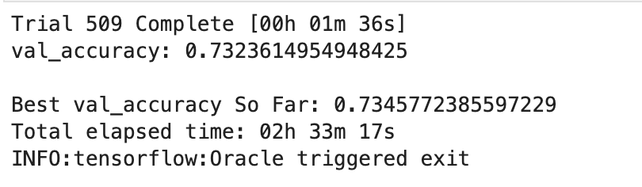

# Nonprofit Analysis

## Overview

The project involves the use of neural net analysis to develop a model to aid in the assessment of investments towards non-profit organizations funded by the foundation to help identify those that make effective use of funds to aid in investments in the future.  This project looks at various features of each organization including the type of funding requested and the organization characteristics and a summary of the success of each organization. The analysis was completed using the Python module Tensorflow and SK-Learn to preprocess the data and develop the model using a neural net to optimize the model estimations.  The goal is to provide a prediction for organization applications to improve the current success rate of 53.2% through the use of the model. 

---

## Results

### Preprocessing the Data

Preprocessing the data involved a number of steps to get the data organized and in a format that can be effectively used in the neural net model.  Each step is targeted to refine the data and ensure that it gives a fair representation of the dataset while being optimized for the analysis.  

1. From the data set it was determined that the IS_SUCCESSFUL column would be the target for the analysis
    - This data showed the success of each funding project which is the target of the foundation for improvement.

2. Looking at the dataset the seven features that were considered for the initial analysis using the neural net which are listed below.  The STATUS and SPECIAL_CONSIDERATIONS were removed as they contained a majority of the data was dominantly found on one value.  For STATUS there were only 5 inactive values from a total of 34299 and only 27 projects had special considerations.  As these values appear highly biased on one side and their contribution to the model would be nominal.
    * Feature List:
        - Application Type
        - Affiliation
        - Classification
        - Use Case
        - Organization
        - Income Amt
        - Ask Amt

3. Based on the data collected all columns except the EIN and NAME columns would act as featured for the initial iteration of the analysis
    - The data contained in these columns were descriptive and had no bearing on the success of the funding.

Final Dataset

### Create Neural Net Analysis

1. The initial model for the neural net contained 1 input, 1 output and 1 hidden node layer with 74 neurons with sigmoid activation function.
    - The number of neurons were selected as it is a good rule of thumb to use 2-3x the number of inputs for the first layer of neurons, the lower was used to reduce the initial overfitting of the model in the first application
    - The sigmoid activation was selected as most of the features were binary classifiers which would suggest this is a good way to model the relationships between the target and the features
    - The single layer of hidden nodes was to prevent overfitting the model initially
    

2. The result of the initial analysis resulted in an accuracy of 72.4% which was below the target of 75% selected by the foundation as a target for the model.  This result in an improvement over the 53.2% success currently observed of projects funded by the foundation however short of the goal.

3. To increase the performance of the neural net model the following changes to the original configuration were conducted.

    - Increase the number of nodes and neurons in the initial model
        - The neurons of the first hidden layer node were increased to 111 neurons 
            - Increased accuracy to 72.8%

        
        

        - An additional hidden layer node was added with 74 neurons
            - Increased accuracy to 73.1%

        
        

    - Activation method was changed from sigmoid to tanh
        - Reduced accuracy to 72.3%
    

    - Activation method was changed from tanh to rehu
        - Increase accuracy to 72.9% 
    

Based on the findings described above the two hidden nodes with 111 neurons and 74 neurons respectively produced the most accurate results.  As seen in the loss and accuracy data collected from this model the increases in accuracy are diminishing after 130 epochs.

---

## Summary

The results from the deep neural net machine learning model showed the complexity of the issue of predicting the outcome based on performance of pass projects funded by the foundation.  The model was modified a number of times to try and maximize the outcome as described in the results with the maximum accuracy of 73% being achieved.  This model uses a variety of categorical features to create the model but due to the variable results within each of these features the ability to create a strong predictive model is difficult. 

Further investigation of other methods that could be used to predict the success of models were explored.  The use of a Support Vector Machine (SVM) model proved to provide similar results with an accuracy of 73.3% which is a small increase over the neural net model.  This method uses supervised machine learning to create an optimal hyperplane that can separate the successful and unsuccessful funds.  This model is much simpler and faster than the neural net and gives similar results which may make it a more useful method for prediction of the results of the outcome of projects. 

An additional test was run to determine if the optimization of the neural net could be enhanced greater using the Keras-tuner to automate the optimization process.  Using this module the data was tested to determine the top training set to evaluate the best accuracy and loss neural net.  This automated optimization looked up to 6 layers and 100 neurons across sigmoid, tanh and relu activations.  The tuner module ran 509 tests to determine the top training set.  From this the best model produced an accuracy of 73.5% which is a small increase over the SVM and final neural net models discussed earlier.  It should be noted that the best model did incorporate a sigmoid activation which was used in the original neural net model which provided the greatest accuracy in the end.  This shows that the dataset as create restricts the increase of accuracy and well require more cleaning to reduce the noise however too much manipulation could result in an overfitting of the model and may have an impact on predictions on new data analyzed by the model.

---

